  
<!--  -->

  
<!--                -->

### Hi, I'm vancats. 

- 🔭 I’m currently in Hangzhou and working on learning visualization.
- 💬 WeChat: vancats216
- ✉️ Email: vancats777@gmail.com

<!--     -->
              

#### My Data

- [Coding every day](https://github.com/vancats/vancats-leetcode)

<!-- - [Juejin Data](https://juejin.cn/user/2313815570265992/posts) -->

<!--  -->
